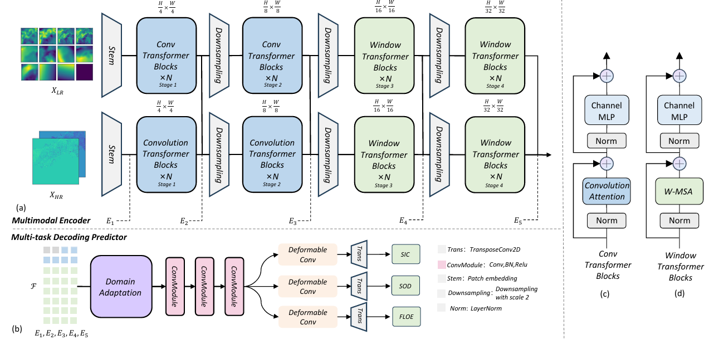

# MFDA
This is the official pytorch implementation of [MFDA: Unified Multi-Task Architecture for Cross-Scenario Sea Ice Classification] (IEEE TGRS). 

The current version supports Python>=3.8.10, CUDA>=11.3.0 and PyTorch>=1.11.0, but it should work fine with lower versions of CUDA and PyTorch. 



## Introduction
Although the extensive research has been conducted on retrieving sea ice variables from synthetic aperture radar (SAR) and multimodal remote sensing data, cross-scene retrieval using regional training models remains a significant challenge. Previous studies have employed multi-task learning (MTL) but have not sufficiently explored the interplay between network architectures and multi-task performance. Moreover, self-supervised learning (SSL) has shown promise in improving tasks with limited training samples, though its potential in sea ice variable retrieval requires further study. To address the challenge of cross-scene retrieval of sea ice variables, we introduce a novel and effective method called multimodal fusion domain adaptation (MFDA), which combines three key strategies: 1) employ SSL methods for multimodal data to pretrain the model, improving its noise sensitivity and promoting a hierarchical understanding of multimodality; 2) propose a unified convolutional and Transformer-based data fusion architecture to enhance the integration of multimodal data and improve semantic understanding; and 3) incorporate a domain adaptation module between the multimodal encoder and the multi-task decoding predictor to facilitate the model’s understanding of the semantic gaps between different regional environments. The performance of the proposed MFDA has been extensively evaluated on the Ai4Arctic dataset. The experimental results demonstrate that MFDA achieves superior performance compared with other state-of-the-art (SOTA) sea ice classification approaches for the task of cross-scene sea ice retrieval. 

## Citation

If you use MFDA in an academic work, please cite:

```
@article{chen2024mfda,
  title={MFDA: Unified Multi-Task Architecture for Cross-Scene Sea Ice Classification},
  author={Chen, Yuhan and Yan, Qingyun and Bashmachnikov, Igor and Huang, Kaijian and Mu, Fangru and Zhang, Zixuan and Xu, Minghuan and Zhao, Jiechen},
  journal={IEEE Transactions on Geoscience and Remote Sensing},
  year={2024},
  publisher={IEEE}
}
```
